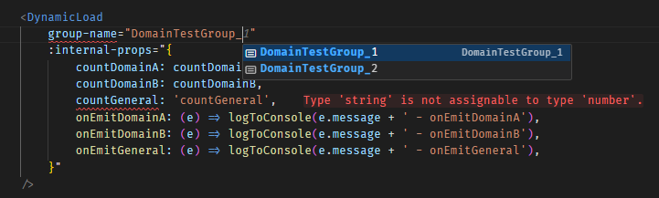

# Dynamic loading of Vue components

- [Dynamic loading of Vue components](#dynamic-loading-of-vue-components)
  - [Description](#description)
    - [Goal](#goal)
    - [But what about `v-if`?](#but-what-about-v-if)
    - [How it works?](#how-it-works)
    - [Usage](#usage)
      - [Wrapper component usage](#wrapper-component-usage)
      - [DOMAIN const](#domain-const)
      - [dynamicLoadList](#dynamicloadlist)
    - [Conclusion](#conclusion)
  - [Project setup / Installation](#project-setup--installation)
  - [Commands](#commands)
    - [Develop](#develop)
    - [Build project](#build-project)
    - [Run build locally](#run-build-locally)
    - [Lints and fix](#lints-and-fix)
    - [Additional commands](#additional-commands)
  - [Development](#development)
  - [Build](#build)
  - [Environment variables](#environment-variables)
    - [NODE\_ENV \& VITE MODE](#node_env--vite-mode)
    - [VITE\_APP\_\*](#vite_app_)

<br>

## Description

Sample project for dynamic loading of Vue components using:

- `typescript` - yes, ambitious goal but finally types and intellisense are working!
- `generic components` -  [more on this]([./docs/DEVELOPMENT.md](https://vuejs.org/api/sfc-script-setup.html#generics))
- `defineAsyncComponent` - for dynamic loading of components
- `vite-plugin-chunk-split` - for chunk splitting



[](https://stackblitz.com/~/github.com/Nagell/dynamic_loading_components?file=src%2Fcomponents%2Fdomain%2FDomainTestParent.vue)

<br>

> [!NOTE]  
> This project is based on my [vue template](https://github.com/Nagell/vue_template). Feel free to use it as a base for your project.

<br>

### Goal

Vue 3 offers a lot of very useful features like `defineAsyncComponent` and generic components.  
What it doesn't offer is a way to use them together in a fully typed way out of the box.  

**So I set myself a goal to make it work!**  

<br>

### But what about `v-if`?  

You could ask:
> But why?  
> A normal way of dealing with this is to use `v-if` or `v-show` directives!.  

Sure, but what if most of your app is almost split in half, but still contains many common parts?  
There are such cases in which your app has to be very flexible in showing many different components for different:

- domains/areas
- client types
- user roles
- user permissions
- depending on the data fetched from the server
- and so on...

Normally you would have to duplicate a lot of code or use a lot of `v-if` directives.  

So I thought, why not make it more dynamic and flexible?  

<br>

### How it works?

The main idea was to create a **generic wrapper component** that will load a one of the components fro a wished group  
depending on the `domain` (user role, client type, etc.).

The `domain` can be set in the `localStorage`, read by `pinia` store and used in the wrapper component.  
Setting it can accompany a login action, result of a server response or any other interaction with the app.

Ideally such wrapper component would have just one additional property which would define the group from which  
one of the components would be loaded and the rest of the properties would be expected by the wrapper based  
on an amalgamation of the types of all the components that could be loaded.

Due to limitations of Vue 3 `generic components`, it's not possible. Still it's possible to make it with two properties:

- `group-name` - for the group
- `internal-props` - for a reactive object with the rest of the properties

<br>

### Usage

If you would like to move the whole plugin to your project, it should be possible by simply copying the `dynamicLoad`  
folder from the `plugins` directory and modifying files mentioned below.

> [!NOTE]  
> Plugin uses `pinia` and `@vueuse/core` - remember to install it in your project.  
> Probably you would also need to copy or exchange the [useLogger](./src/composables/useLogger.ts) composable I used for a better logging.

#### Wrapper component usage

This sample can be found in the [DomainTestParent.vue](./src/components/domain/DomainTestParent.vue) component

```html
<template>
    <DynamicLoad
        group-name="DomainTestGroup_1"
        :internal-props="{
            countDomainA: countDomainA,
            countDomainB: countDomainB,
            countGeneral: countGeneral,
            onEmitDomainA: (e) => logToConsole(e.message + ' - onEmitDomainA'),
            onEmitDomainB: (e) => logToConsole(e.message + ' - onEmitDomainB'),
            onEmitGeneral: (e) => logToConsole(e.message + ' - onEmitGeneral'),
        }"
    />
</template>
<script setup lang="ts">
    import { ref } from 'vue'

    const countGeneral = ref(999)
    const countDomainA = ref(100)
    const countDomainB = ref(200)

    const logToConsole = (value: any) => {
        console.log(value)
    }
</script>
```

#### DOMAIN const

The `DynamicLoadListShape` is a type that ensures that the `dynamicLoadList` object has the correct structure,  
and relies on the `DOMAIN` const by allowing only the keys defined as the possible domains.  
The const is defined in the [localStorage.ts](./src/plugins/dynamicLoad/internals/types/localStorage.ts) file.

> [!NOTE]  
> Modify it to match your wished domains/areas/groups/roles etc.  

```typescript
export const DOMAIN = {
    DOMAIN_A: 'domain_A',
    DOMAIN_B: 'domain_B',
} as const

```

> [!NOTE]  
> There is one more thing to change in the [dynamicLoadFilters.ts](./src/plugins/dynamicLoad/internals/types/dynamicLoadFilters.ts) file.  
> At the very end of the file you have to add your domains like so to get the full support of the types and intellisense.  

```typescript
type YourDomainAComponentProps<G extends DynamicLoadGroups>
    = FilterComponentsProps<G> extends { YOUR_DOMAIN_A: unknown }
        ? FilterComponentsProps<G>['YOUR_DOMAIN_A'] : object

//...
export type CombinedComponentsProps<G extends DynamicLoadGroups> = Prettify<
    YourDomainAComponentProps<G>
    & YourDomainBComponentProps<G>
>
```

#### dynamicLoadList

The mentioned previously component list is located in the [dynamicLoadList.ts](./src/plugins/dynamicLoad/dynamicLoadList.ts) file.

```typescript
export const dynamicLoadList = {
    DomainTestGroup_1: {
        DOMAIN_A: defineAsyncComponent(DomainTestGroup_1_domain_A),
        DOMAIN_B: defineAsyncComponent(DomainTestGroup_1_domain_B)
    },
    DomainTestGroup_2: {
        DOMAIN_B: defineAsyncComponent(DomainTestGroup_2_domain_B)
    },
} satisfies DynamicLoadListShape
```

> [!NOTE]  
> Modify it to match your wished groups and components.

<br>

### Conclusion

Probably it could be done simpler if there would be more native support for generics in Vue 3,  
but it works, is fully typed and offers a lot of flexibility and potential for extending.  
Feel free to use it in your project, improve it and share your thoughts via discussions in this repo.

<br>

## Project setup / Installation

Assuming that you have already installed `Node.js`,  
go to the root directory and run the following commands.

```bash
# Install globally Yarn package manager
npm install -g yarn

# Install dependencies
yarn run init
```

<br>

## Commands

### Develop

Start the app in development mode with hot-reloads

```bash
yarn run serve
```

### Build project

```bash
# Build for production
yarn run build:prod

# Build for staging
yarn run build:staging
```

### Run build locally

```bash
yarn run preview
```

### Lints and fix

```bash
# Only lint
yarn run lint

# Lint and fix
yarn run lint:fix
```

### Additional commands

```bash
# Install dependencies for ci
## Helpful when you want to install all dependencies for a CI pipeline,  
## reassuring that they are installed exactly as in the `yarn.lock` file.
yarn run ci

# Clean dependencies
## Helpful when you want to reinstall all dependencies.
yarn run clean
```

<br>

## Development

All commands, tips and tricks and documentation about used tools and libraries are in the  
[DEVELOPMENT.md](./docs/DEVELOPMENT.md) file.

<br>

## Build

```bash
yarn run build:prod
# or
yarn run build:staging
```

The builds are saved in the `/dist` directory.

<br>

## Environment variables

### NODE_ENV & VITE MODE

The NODE_ENV=production is not supported in the .env file in Vite  
Only NODE_ENV=development is supported to create a development build of the project  
Vite has also so called Mode, depending on the .env file used for build or a serve command.  

Respectively it uses

- `.env` or `.env.development` file for development mode (serve command)
- `.env.production` file for production mode (build command)
- `.env.[mode]` file for custom mode (build command with --mode [mode] argument)

If you need some local environment variables, use `.env.development.local` file.

More about modes [here](https://vitejs.dev/guide/env-and-mode.html#modes)  

To make use of it in your code, you can use `import.meta.env.MODE` variable.

```javascript
if (import.meta.env.MODE !== 'production') {
  console.log('Not the production mode');
}
```

<br>

### VITE_APP_*

Use `VITE_APP_` prefix to expose environment variables to your app  

```bash
VITE_APP_API_URL=https://api.example.com
```
